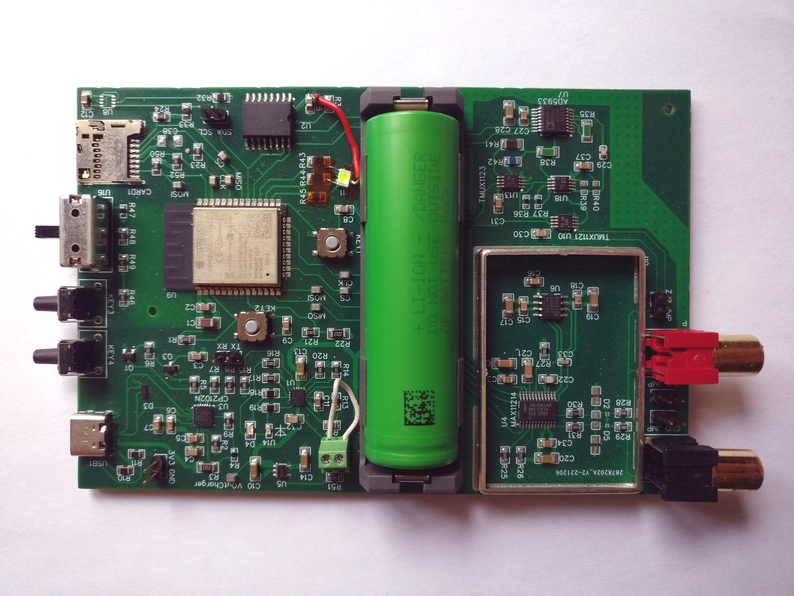

# PlantAI
Device ESP32 based device for measuring plant biopotentials over time.

- ADC: MAX11214
- Impedance converter: AD5933
- RTC: DS3231SN#
- Environment Sensor: BME280
- see BOM for details
  

